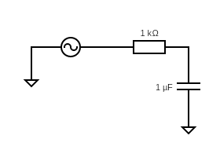
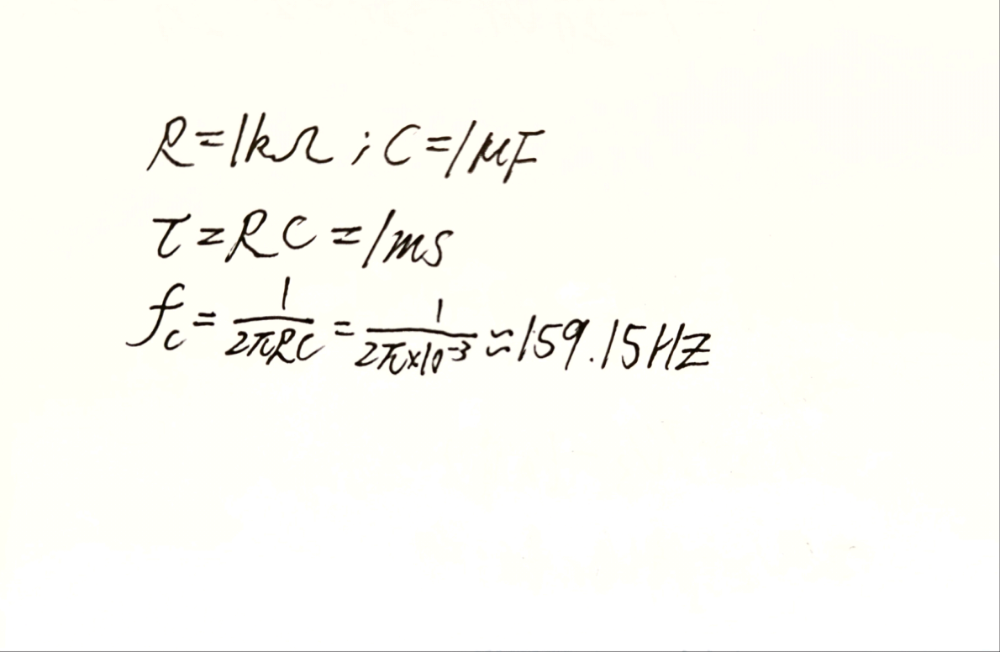
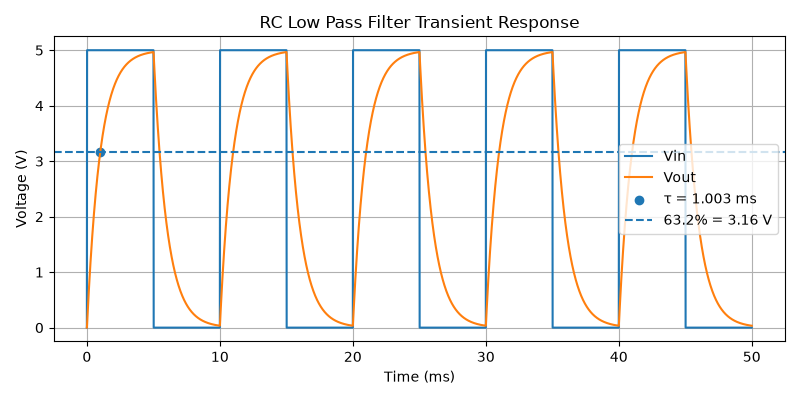
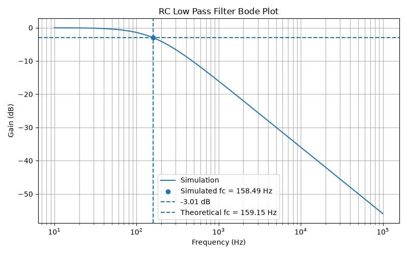
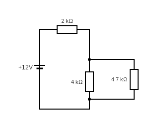
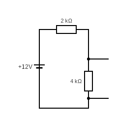
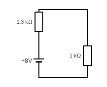
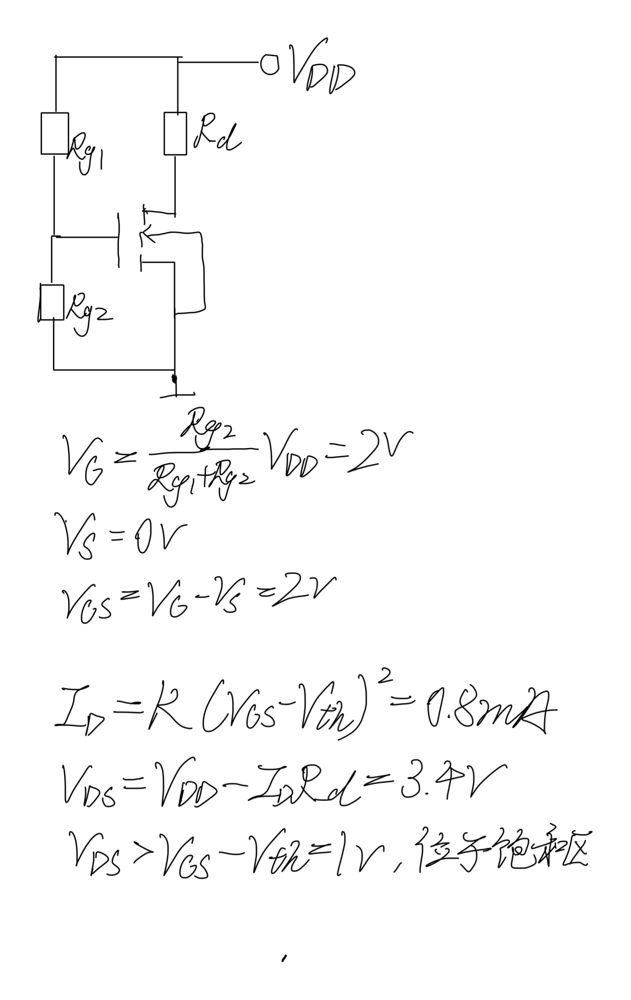
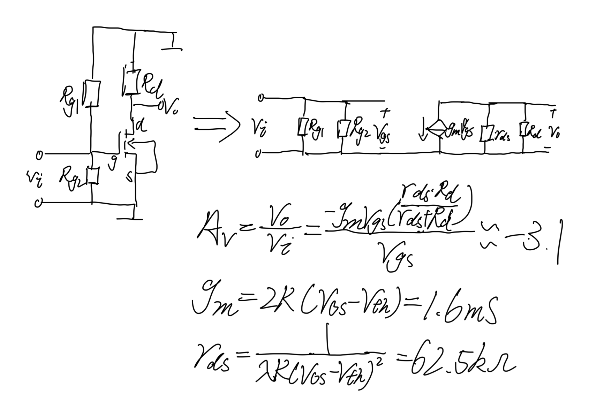
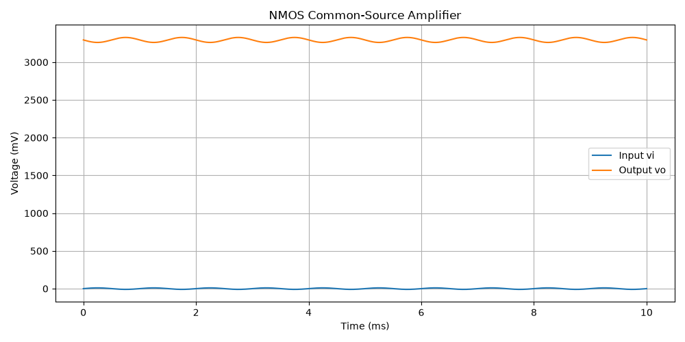

# 集协项目

## 目录
### 个人资料
- [个人网页](#个人网页)
- [pdf版简介](#pdf版简介)
### 贪吃蛇
- [前言](#前言)
- [使用MIT原因](#使用MIT原因)
- [防“纯粘贴”承诺](#防纯粘贴承诺)
- [AI 给过但我查证后认为是错误的信息](#ai-给过但我查证后认为是错误的信息)
- [阶段一](#阶段1)
- [阶段二（增加计分制）](#阶段二增加计分制)
- [阶段二（选择风格）](#阶段二选择风格)
- [阶段二（接入风格）](#阶段二接入风格)
- [阶段二（历史记录）](#阶段二历史记录)
- [阶段二（优化按钮）](#阶段二优化按钮)
- [阶段2（画面优化）](#阶段二画面优化)

### 进阶挑战
- [RC低通滤波电路](#RC低通滤波电路)
- [验证戴维南定理](#验证戴维南定理)
- [NMOS放大电路](#NMOS放大电路)
- [AI使用情况](#AI使用情况)

# 个人资料
## 个人网页
网站地址：https://tomatoglue94.github.io/personal-website/ 
网站仓库地址：https://github.com/tomatoglue94/personal-website

## pdf版简介
- [查看简介](个人简介.pdf)

# 贪吃蛇

## 前言

制作过程中使用了Claude搭载DeepSeek v4pro的agent编写代码，并且加载了superpower的插件，让agent在执行命令时自主发现问题询问需求中可能引发歧义的地方并且在开发完成后自查。

在设计贪吃蛇的程序时，我先在GPT中交流打磨我的提示词，然后再将GPT修改润色过的提示词输入Claude中。

验证方法大多是通过自己打开网页测试，并且插件自带了AI自主的验证流程

设计完之后我让AI自己读取了存储的缓存，输出了全部的对话和编辑记录

## 防“纯粘贴”承诺

AI自动避开思路是运用了BFS自动寻路算法，在阶段二（AI游玩）的提示词中我自行向AI解释了BFS的原理

刷新后风格保持不变的原理是运用了localStorage，并且在程序中添加了脚本使屏幕在渲染前先检查主题选择，在渲染，防止刷新的一瞬间闪一下默认的主题

## 使用MIT原因

MIT License允许他人自由使用、修改和分发本项目代码，同时要求保留原作者的版权声明和许可证文本，并且MIT明确了责任的划分，确保他人使用代码出现责任时我是免责的，同时也不保证代码一定准确。

## AI 给过但我查证后认为是错误的信息

上文提到的MIT使用原因中明确了责任的划分，GPT跟我说的是选择 MIT License 的大致原因大致总结是： MIT License 能够在保留基本版权要求的同时，方便其他人参考和使用。但我思考后查找发现MIT中有一句话“THE SOFTWARE IS PROVIDED "AS IS", WITHOUT WARRANTY OF ANY KIND…”这句话及后续的声明强调了责任免责和代码实用性的提前声明，我觉得这应该是MIT对于安全最不可或缺的一部分之一，但是GPT忽略了这一点

## 阶段1

### 关键提示词

### 原文

生成**单文件 HTML/CSS/JS**，无任何框架依赖，双击 HTML 文件即可直接在浏览器打开运行，不要拆分多个文件，不要引入外部 CDN 资源。

画布与地图参数

- 地图网格规格：20 列 × 20 行；单格尺寸 `CELL_SIZE = 30px`；画布整体尺寸固定 800px × 800px

- 画布背景底色：纯白色

- 蛇头：30×30px，红色，带小圆角，和蛇身尺寸一致，用于区分头部

- 蛇身体：30×30px，橙色，设置 2‑4px 圆角，弱化方块生硬感

- 食物：30×30px，蓝色，占满完整格子；**生成食物时禁止出现在蛇身体坐标上**，吃掉食物后立刻重新生成合法位置的食物

- 游戏移动时间间隔：固定 200ms 每帧，全程速度不变

游戏初始逻辑

1. 开局拥有欢迎界面，**按下空格键启动游戏**，游戏未启动时蛇不会移动

2. 蛇初始出生在地图中间位置，设置合理初始长度，设定默认朝右作为初始移动方向

3. 按键控制：W A S D 控制蛇移动方向；**禁止直接 180° 反向掉头**，例如向右移动时按下 A 向左会直接忽略该按键输入，其余反向同理

得分系统

1. 游戏得分实时展示在**地图画布右上角**，文本格式显示 “分数：X”；每吃掉 1 个食物固定 + 1 分

2. 游戏运行过程分数持续刷新，游戏结束后保留最终分数

游戏结束 & 胜利规则

结束触发条件（满足任意一条游戏终止）

1. 蛇撞击画布墙壁边界

2. 蛇头碰撞到自身蛇身体

3. 键盘按下 P 按键，手动结束本局游戏

游戏结束界面**不输出死亡原因**，只展示最终分数

胜利条件

- 当蛇完全占满全部地图网格，判定为游戏胜利通关

重开机制

- 游戏结束 / 胜利之后，支持按键重新开局；游戏结束后 WASD 不再响应移动，仅响应重开按键

其他约束

1. 按键响应：按下按键立刻生效转向，不需要回车确认

2. 不需要暂停游戏功能

3. 全部逻辑写在单个 HTML 文件内部，CSS 写 style 标签，JS 写 script 标签，浏览器原生能力实现，无第三方库。

### 想让AI做什么

根据我和GPT打磨的提示词创建一个符合阶段1要求的贪吃蛇

### AI实际动作

成功按照要求创建，但是画布大小发生偏移，我发现画面一部分被挡在浏览器界面外

### 提示词调整

将贪吃蛇画面修改成20x×30x，居中绘制在800x正方形画布中再向下偏移10x，右上角用于计分

## 阶段二（增加计分制）

### 关键提示词

>在E:\claude\project的claudesnake.html是我的项目,我需要修改一些代码满足一下要求：我要新增计分制：记录得分 / 最高分 / 局数；新一局不清零；有「重置」按钮
得分最高分和局数从上到下显示在右上角；重置按钮在右下角，用鼠标点击时生效，大小与得分两字字体相仿

### 想让AI做什么

加三行累计计分 + 一个鼠标点击的重置按钮

### AI的实际行动

修改9处代码，自主JS检验，但是布局出错，右上角的新增数据全部竖排放置，超出了可视范围

### 提示词怎么调整

现在得分超出了浏览器界面看不到了，将得分、最高分、局数依次从左向右紧贴平铺在贪吃蛇活动界面的上界的上方

### 调整结果

改为单行横排、从地图左边界对齐、画在地图上边界（y=100）上方（文字中心 y=50），并主动提示「右下角的重置按钮同样贴右边，可能也会被裁，需要的话我一起调整」。

阶段二（AI游玩）

### 关键提示词

>我现在要新增一个AI功能，按键要求：取消初始用空格键开始的方式，在WASD操控方向的提示下面从左向右依次添加“独自游玩”和“AI游玩”两个按键，按键形式与重置按键形式相同。在点击ai游玩时由ai全权操控贪吃蛇，独自玩时由WASD人工操控，以下是AI算法要求：把整个地图看成网格，蛇身和墙壁是「不可通行障碍物」，每移动一帧，用 BFS 从**蛇头坐标**出发，搜索到**食物坐标**的最短可行路径，取路径的第一步作为蛇的下一步方向。

### 想让 AI 做什么

加双模式（人工 / AI），AI 用 BFS 最短路径寻路

### AI 的实际动作

我的提示词有3个易引发歧义的地方，ai主动提出问题

| AI 的问题 | 我的回答 |

| 取消空格键后，游戏结束界面怎么重新开局？ | 完全移除空格键（开始/重开都只能点按钮） |

| 两个按钮什么时候显示？ | 仅非游戏时显示（游戏中隐藏，避免遮挡地图） |

| BFS 找不到路径（蛇身把路堵死）时 AI 怎么办？ | 选安全方向续命 |

### 提示词怎么调整

在回答了问题之后一次成功，无需调整

## 阶段二（选择风格）

### 关键提示词

>要给贪吃蛇游戏设计背景风格，给我推荐2种配色组合，有问题问我

### AI 的实际动作

. 先问调性（复古街机 / 赛博霓虹 / 极简深色 / 清新糖果）→ 我选**复古街机像素风**

2. 给出**方案 A 磷光绿 CRT（P1 Phosphor）**与**方案 B 机台霓虹**

3. 「有其他风格吗」→ 补**方案 C 极简深色**、**方案 D 清新明亮糖果色**

4. 「保存在 e：code」→ 生成 `E:\code\snake-palettes.html`：单文件、纯本地、四张卡片并排、同一份蛇盘逻辑同一段动画，只有颜色不同

5. 「我要其他调性」→ 多选询问 → 我选**蒸汽波 Vaporwave + 深空宇宙** → 补**方案 E、F**

6. 「加进去对比」→ 页面扩到 6 套

## 阶段二（接入风格）

### 关键提示词

>我在E:\claude\project里面有个claude.html文件，那是我的贪吃蛇游戏，我需要你把磷光绿
CRT和蒸汽波风格加进去，默认是磷光绿风格，在独自游玩和ai游玩的正下方对齐并排添加2个风格按钮，左边的是磷光绿切换按钮按钮名字为磷光绿，
按下会切换成磷光绿，如何已经是磷光绿则按了不响应，右边的是切换成蒸汽波风格的按钮，但是按钮的名字改成霓虹风。先不要改所有按钮和文字的风格，我需要贪吃蛇的风格在刷新之后还保持选定后的风格，有问题提出来

### 想让 AI 做什么

把配色接入游戏；加两个风格切换按钮；先不要改按钮和文字样式。

AI 的实际动作

先提出了3个问题

| AI 的问题 | 我的回答 |

| 深色主题染到哪一层？ | 整块画布变深 |

| 欢迎/结束/胜利的白色覆盖层怎么处理？ | 跟随主题 |

| 要不要给当前风格的按钮加激活状态？ | 加一个激活标记 |

### 结果

成功添加2套模板，但是重置键被意外修改

### 提示词调整

>我要求按重置键的时候回到主菜单（就是可以选择风格、游玩方式的界面）

## 阶段二（历史记录）

### 关键提示词

>我现在要给贪吃蛇新增新功能记录最近 10 局结果；新一局自动追加；可查看完整列表，这个查看完整列表的功能按钮在重置键的上方，有问题问我
面板打开时游戏暂停，关闭时继续

### 想让 AI 做什么

历史战绩面板 + 打开面板时暂停游戏

### AI 的实际动作

问了4个问题

| AI 的问题 | 我的回答 |

| 一条记录包含哪些信息？ | 局数 + 得分 + 结果 + 模式 |

| 记录要跨刷新保留吗？ | 不保留，刷新就清空 |

| 「记录最近 10 局」和「查看完整列表」什么关系？ | 只存 10 条，列表就是这 10 条 |

| 游戏中途点「重置」回主菜单的那局，算记录吗？ | 不算 |

### 结果

基本按照要求执行，但是模式按钮压在面板上、面板半透明导致底层文字透出，但是AI自己检查的时候发现了，自己转义修改了

## 阶段二（优化按钮）

### 关键提示词

>我在E:\claude\project里的claudesnake是我的贪吃蛇项目，这个项目里面内置了2种不同的风格，我需要你根据不同的风格更改每个按钮和文字样式，有问题问我

### 让 AI 做什么

把上一轮被明确「先不要改」的按钮和文字，这一轮补齐。

### AI的实际动作

询问了2个·问题| AI 的问题 | 我的回答 |

| 按钮和文字改到什么深度？ | 完整风格化（磷光绿=CRT 终端感直角细边框；霓虹风=大圆角霓虹描边外发光） |

| 磷光绿 CRT 那套用哪个字体？（约束是不能引外部 CDN，只能用系统字体） | 宋体主打 |

### 结果

一次完成

## 阶段二（画面优化）

### 关键提示词

>在E:\code里面有个snake-palettes.html的演示文件，在E:\claude\project的claudesnake是我自己的程序，我想你将我的程序中的棋盘更改为演示图一样的有深浅交错的类型，并且把我的程序的贪吃蛇的蛇身更改成演示图里面的样子（有蛇眼、还有身子的层次），在把食物换成演示图里面的那样子，这一切修改建立在符合风格的基础上

### 想让 AI 做什么

照演示页改造棋盘、蛇身、食物，且必须与现有两套风格兼容。

### AI 的实际动作

正确按照提示词完成

# 进阶挑战

## RC低通滤波电路
### 电路图

交流电压为v​(t)=1sin(2πt) V

### 手算截止频率

### RC低通滤波-波形图

### RC低通滤波-波特图

### 表1 RC低通滤波器理论值与仿真值对比

| 参数 | 理论值 | 仿真值 | 相对误差 |
|:---|---:|---:|---:|
| 时间常数 τ | 1.000 ms | 1.003 ms | 0.29% |
| 截止频率 fc | 159.15 Hz | 158.49 Hz | 0.42% |

## 验证戴维南定理

### 电路图
负载为4.7kΩ电阻

### 含源二端口示意图
开路电压为4kΩ分压所分得的电阻；输入电阻为两个电阻并联后的等效电阻

### 戴维南等效
将端口替换为8V电压源与1.3kΩ电阻并与负载连接

### 表2 验证戴维南定理理论值与仿真值对比
| 参数 | 理论值 | 仿真值 | 相对误差 |
|:---|---:|---:|---:|
| Voc | 8.000 V | 8.000 V | 0.00% |
| Isc| 6.000 mA | 6.000 mA | 0.00% |

| 参数 | 原电路手算 | 原电路仿真 | 戴维南等效仿真 |
|:---|---:|---:|---:|
| VL | 3.429 V | 3.429 V | 3.429 V |
| IL | 3.429 mA | 3.429 mA | 3.429 mA |

## NMOS放大电路
### 直流等效电路
手算了VGS、VDS和ID，比较得出了电路位于饱和区
计算ID的时候没有考虑沟道长度调制

### 交流等效电路
手算了gm、Av和rds

### NMOS波形图

### NMOS 共源放大电路静态工作点手算值与仿真值对比

| 参数 | 手算值 | 仿真值 | 相对误差 |
|:---|---:|---:|---:|
| VGS | 2.0000 V | 2.0000 V | 0.00% |
| ID | 0.8000 mA | 0.8527 mA | 6.59% |
| VDS | 3.4000 V | 3.2946 V | 3.10% |

### NMOS 共源放大电路小信号参数手算值与仿真值对比

| 参数 | 手算值 | 仿真值 | 相对误差 |
|:---|---:|---:|---:|
| gm | 1.6000 mS | 1.7054 mS | 6.59% |
| rds | -3.1008 | -3.3051 | 6.59% |

### NMOS 共源放大电路输入、输出信号对比

| 参数 | 理论值 | 仿真值 |
|:---|---:|---:|
| 输入信号幅值 | 10.00 mV | 10.00 mV |
| 输出信号幅值 | 31.01 mV | 33.05 mV |
| 电压增益 Av | -3.1008 | -3.3051 |

## AI使用情况
全部代码都由ai提供，我负责前期的提供参数和最后的检查
唯一调整过的部分是RC低通滤波器的时候，ai用了in作为节点名称，但是这是关键字，我自己改成了vin

